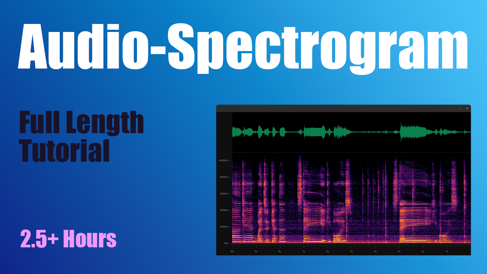

# Audio Spectrogram

A Python + ModernGL + PyAudio live audio spectrogram visualisation app tutorial final project.



Youtube playlist link: https://www.youtube.com/playlist?list=PLswiMBSI75YtHWBiaI8vPCXksX7_M6xa6

## Setup

```
# Linux
sudo apt install pulseaudio
# Mac
brew install pulseaudio

virtualenv -p python3 venv
source venv/bin/activate
pip install -r requirements.txt
```

# Run

```
make
```
