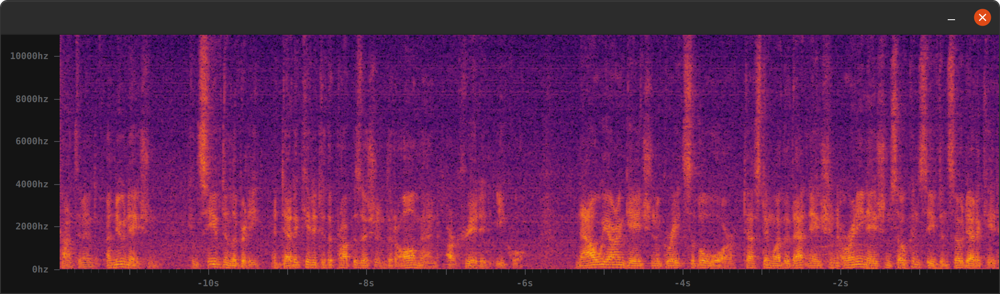

# Audio Spectrogram 

A live spectrogram visualizer made with pyqt5, moderngl and pyaudio.



### Setup environment (ubuntu)

```
sudo apt install portaudio19-dev
virtualenv -p python3 .
source bin/activate
pip install -r requirements.txt
```

### Run

```
make microphone
make file
```


